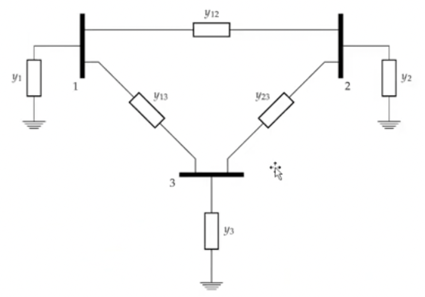
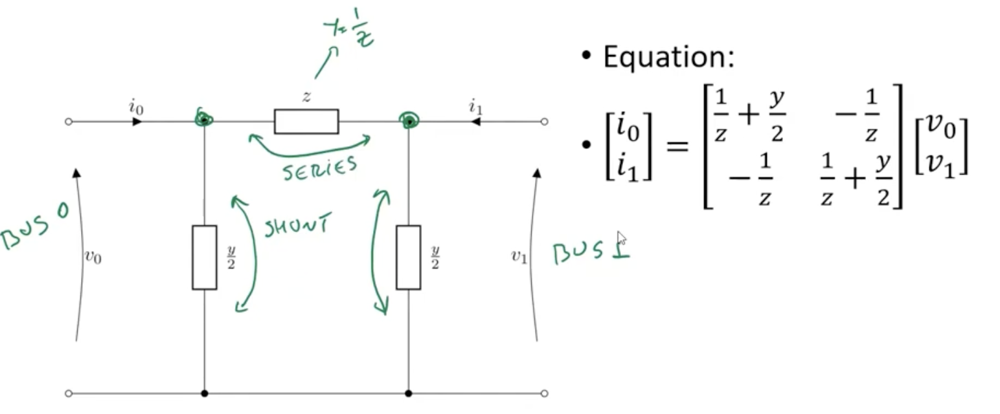

## PyPSA

## Functionality (from website)
PyPSA can calculate:

- static power flow (using both the full non-linear network equations and the linearised network equations)
- linear optimal power flow (least-cost optimisation of power plant and storage dispatch within network constraints, using the linear network equations, over several snapshots
- security-constrained linear optimal power flow
- total electricity/energy system least-cost investment optimisation (using linear network equations, over several snapshots and investment periods simultaneously for optimisation of generation and storage dispatch and investment in the capacities of generation, storage, transmission and other infrastructure)

It has models for:

- meshed multiply-connected AC and DC networks, with controllable converters between AC and DC networks
- standard types for lines and transformers following the implementation in pandapower
- conventional dispatchable generators with unit commitment
- generators with time-varying power availability, such as wind and solar generators
- storage units with efficiency losses
- simple hydroelectricity with inflow and spillage
- coupling with other energy carriers (e.g. resistive Power-to-Heat (P2H), Power-to-Gas (P2G), battery electric vehicles (BEVs), Fischer-Tropsch, direct air capture (DAC))
- basic components out of which more complicated assets can be built, such as Combined Heat and Power (CHP) units and heat pumps.

### AC Power Bus
A bus is a node at which several components of the power system (e.g. generators, loads, transformers) are connected. A bus enforces energy and charge conservation laws. Four parameters are used to describe the bus, which are 

| Notation                | Description                    | Calculation     |
| ----------------------- | ------------------------------ | --------------- |
| $\vert \tilde{V} \vert$ | the amplitude of the volatge   |                 |
| $\Theta$                | the phase angle of the voltage |                 |
| $P$                     | the active power               | $Re(\tilde{S})$ |
| $Q$                     | the reactive power             | $Im(\tilde{S})$ |

In practice, we usually know two of the parameters according to the different types of nodes (buses)

| Bus Type               | $\vert \tilde{V} \vert$ | $\Theta$ | $P$     | $Q$     |
| ---------------------- | ----------------------- | -------- | ------- | ------- |
| Generator Bus (PV-bus) | known                   | unknown  | known   | unknown |
| Load Bus (PQ-bus)      | unknown                 | unknown  | known   | known   |
| Slack or Reference Bus | known                   | known    | unknown | unknown |

### Power Bus in PyPSA
We can use ```add(class_name="Bus", name="Bus")``` or to add a bus into a predefined network generated by PyPSA. The parameters of a bus class are as listed below:
- name: The name of the bus named by the user
- v_nom: nominal voltage
- type: according to the bus type described in section AC Power Bus
- x: position in SRID system (longitude)
- y: position in SRID system (latitude)
- carrier: energy form (AC, DC, heat, gas)
- unit: unit for the bus carrier (usually MW)
- v_mag_pu_set: voltage magnitude set point
- v_mag_pu_min: minimum voltage in percentage
- v_mag_pu_max: maximum voltage in percentage

From one bus to multi buses which form a network of power grid, we need an admittance matrix to describe the connections between each bus through lines. Thus, a concept of admittance matrix is coming into sight. Taking a three-node network as an example



The admittance matrix is like
$$
\begin{bmatrix}
    y_{11}+y_{12}+y_{13} & -y_{12} & -y_{13} \\
    -y_{21} & y_{22}+y_{21}+y_{23} & -y_{23} \\
    -y_{31} & -y_{32} & y_{33}+y_{31}+y_{32}
\end{bmatrix}
$$
which is symmetric.

### Lines
To describe a line in real power system, we typically adopt the $\pi$-model as in .

### Lines in PyPSA
We can use ```add(class_name="Line", name="Line")``` or to add a line into a predefined network generated by PyPSA. The parameters of a line class are as listed below:
- name: The name of the line named by the user
- bus0: the name of the first connected bus
- bus1: the name of the second connected bus
- type: different strinf expressions of simplified real lines
- x: series reactance $z = r + jx$
- r: series resistence $z = r + jx$
- g: shunt conductivity $y = g + jb$
- b: shunt susceptance $y = g +jb$
Other parameters about lines in PyPSA could be found [here](https://pypsa.readthedocs.io/en/latest/components.html#line).

### Transformers
Transformers are edges in the network that connects two different AC buses with different voltages. With voltage transforming, the voltage level could be altered by them.

### Transformer in PyPSA
We can use ```add(class_name="Transformer", name="Transformer")``` or to add a transformer into a predefined network generated by PyPSA. The parameters of a transformer class are as listed below:
- name: The name of the transformer named by the user
- bus0: the name of the first connected bus
- bus1: the name of the second connected bus
- type: different strinf expressions of simplified real transformers
- x: series reactance $z = r + jx$
- r: series resistence $z = r + jx$
- g: shunt conductivity $y = g + jb$
- b: shunt susceptance $y = g +jb$
- tap_ratio: 
- tap_side:
- phase_shift:
Other parameters about transformers in PyPSA could be found [here](https://pypsa.readthedocs.io/en/latest/components.html#transformer).

#### Links in PyPSA
We can use ```add(class_name="Link", name="Link")``` or to add a link into a predefined network generated by PyPSA. The parameters of a link class are as listed below:
- name: The name of the link named by the user
- bus0: the name of the first connected bus
- bus1: the name of the second connected bus
- type: different strinf expressions of simplified real links
- carrier: energy carrier like AC or DC
- efficiency: efficiency of converting from bus0 to bus1
- p_nom: nominal power 
- p_nom_min: minimum nominal power bound
- p_nom_max: maximum nominal power bound
- x: series reactance $z = r + jx$
- r: series resistence $z = r + jx$
- g: shunt conductivity $y = g + jb$
- b: shunt susceptance $y = g +jb$
Other parameters about links in PyPSA could be found [here](https://pypsa.readthedocs.io/en/latest/components.html#Link.

### Generators
Generators attach to a single bus and can feed in power, converting energy from its carrier to the carrier type of the bus to which it's attached. It could be conventional units like thermal generators or environment-depedent generators like renewables of wind turbines, solar panels and hydro. It could offer both active and reactive power to the grid.

### Generators in PyPSA
We can use ```add(class_name="Generator", name="Generator")``` or to add a generator into a predefined network generated by PyPSA. The parameters of a generator class are as listed below:
- name: The name of the generator named by the user
- bus: the name of the connected bus
- control: the control strategy "PQ", "PV", "Slack"
- carrier: energy carrier used like coal and gas
- p_nom: nominal power
- p_nom_min: minimum nominal power bound
- p_nom_max: maximum nominal power bound
- p_nom_extendable: whether this generator is expansionable
- p_set: active power set point
- p_min_pu: minimum power output per unit of p_nom
- p_max_pu: maximum power output per unit of p_nom
- q_set: reactive power set point
- capital_cost: unit capacity cost
- marginal_cost: unit marginal cost
- efficiency_store: efficiency of storage energy 
- efficiency_dispatch: efficiency of stored energy dispatch
Other parameters about generator in PyPSA could be found [here](https://pypsa.readthedocs.io/en/latest/components.html#Generator.

### Load
Typically when we talk about load in power system analysis,it is referenced as the aggregation of multi loads from different users. It will be aggregated into one bus on a fixed resolution. Both active and reactive power will be consumed in the load.

### Load in PyPSA
We can use ```add(class_name="Load", name="Load")``` or to add a load into a predefined network generated by PyPSA. The parameters of a load class are as listed below:
- name: The name of the load named by the user
- bus: the name of the connected bus
- carrier: energy carrier used like coal and gas
- type: placeholder for load types (not implemented)
- p_set: active power set point
- q_set: reactive power set point
- p: active power
- q: reactive power
Other parameters about load in PyPSA could be found [here](https://pypsa.readthedocs.io/en/latest/components.html#Load.

### Storage Unit in PyPSA
We can use ```add(class_name="StorageUnit", name="StorageUnit")``` or to add a storage unit into a predefined network generated by PyPSA. The parameters of a storage unit class are as listed below:
- name: The name of the storage unit named by the user
- bus: the name of the connected bus
- carrier: energy carrier used like coal and gas
- type: placeholder for load types (not implemented)
- p_nom: nominal power
- p_nom_min: minimum nominal power bound
- p_nom_max: maximum nominal power bound
- p_nom_extendable: whether this generator is expansionable
- p_set: active power set point
- p_min_pu: minimum power output per unit of p_nom
- p_max_pu: maximum power output per unit of p_nom
- p_set: active power set point
- q_set: reactive power set point
- capital_cost: unit capacity cost
- marginal_cost: unit marginal cost
- state_of_charge_initial: state of charge before the snapshots
- state_of_charge_initial_per_period: if True, then state of charge at the beginning of an investment period is set to state_of_charge_initial
- state_of_charge_set: state of charge set point
- p: active power
- q: reactive power
- efficiency_store: efficiency of storage energy 
- efficiency_dispatch: efficiency of stored energy dispatch
- standing_loss: losses during holding energy
- max_hours: maximum state of charge capacity in terms of hours at full output capacity p_nom
Other parameters about load in PyPSA could be found [here](https://pypsa.readthedocs.io/en/latest/components.html#Load.